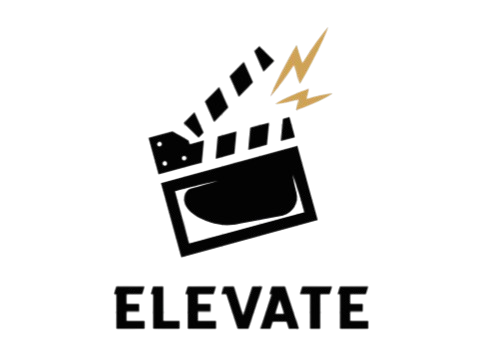

<h1 align="center"> Elevate</h1>
 
<div align="center">

<br><br>
<p><em>A utility that sorts movies</em></p>
</div>
 
---
 
## 📚 Table of Contents
 
- [About the Project](#about-the-project)
- [Used Technologies](#used-technologies)
- [Contributors](#contributors)
- [Download](#download)
 
---
 
<a id="about-the-project"></a>
## 🎯 About the Project
 
Elevate is a lightweight utility that takes your chaotic movie list and sorts it exactly how you want it. Whether you're looking for the highest-rated sci-fi films of the 90s or just trying to organize your local media files, this tool handles the heavy lifting so you can spend less time scrolling and more time watching.
 
---
 
 
<a id="used-technologies"></a>
## 🛠️ Used Technologies
 
| Logo | Tool | Purpose |
| :--: | :--- | :------ |
|  | [Visual Studio 2022](https://visualstudio.microsoft.com/vs/) | Primary IDE |
|  | [GitHub](https://github.com/) | Version Control |
|  | [Microsoft Word](https://en.wikipedia.org/wiki/Microsoft_Word) | Documentation |
|  | [MS PowerPoint](https://bg.wikipedia.org/wiki/Microsoft_PowerPoint) | Presentations |
|  | [MS Teams](https://www.microsoft.com/en-us/microsoft-teams/group-chat-software) | Communication |
|  | [Canva](https://www.canva.com/) | Logo Design |
|  | [C++](https://cplusplus.com/) | Programming Language |

---
---
 
<a id="contributors"></a>
## 👥 Contributors
 
| Name | Role | Contact |
| :--- | :--- | :------ |
| [**Dimana Foteva** (9g)](https://github.com/DGFoteva24) | 🧑‍🏫 Scrum Trainer | [DGFoteva24@codingburgas.bg](mailto:DGFoteva24@codingburgas.bg) |
| [**Todor Neshev** (9b)](https://github.com/TNNeshev24) | ⚙️ Designer | [TNNeshev24@codingburgas.bg](mailto:TNNeshev24@codingburgas.bg) |
| [**Mariela Apostolova** (9b)](https://github.com/MQApostolova24) | ⚙️ Backend Developer | [MQApostolova24@codingburgas.bg](mailto:MQApostolova24@codingburgas.bg) |
| [**Vilian Ivanov** (9g)](https://github.com/VIIvanov24) | ⚙️ Frontend Developer | [VIIvanov24@codingburgas.bg](mailto:VIIvanov24@codingburgas.bg) |
 
---
 
## 📄 Documentation
 
| Document | Link |
| :------- | :--- |
|   Word Document | [Elevate.docx](MovieManager/documentation/Elevate.docx) |
|   PowerPoint Presentation | [Elevate.pptx](MovieManager/documentation/Elevate.pptx) |
 
---
 
<a id="download"></a>
## ⬇️ Download
 
To download the project, clone the repository by running the following command:
 
```bash
git clone "https://github.com/codingburgas/Elevate.git"
```
